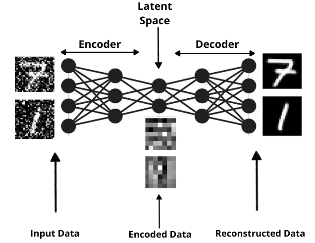
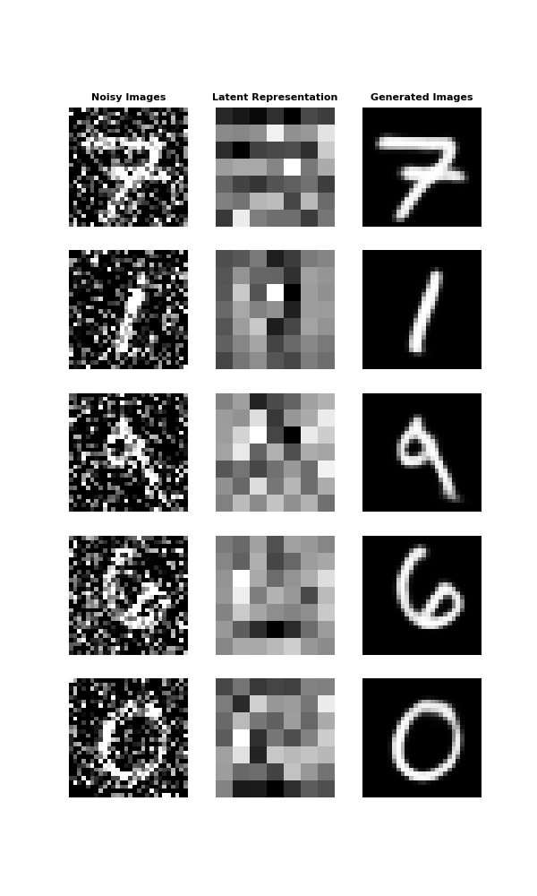
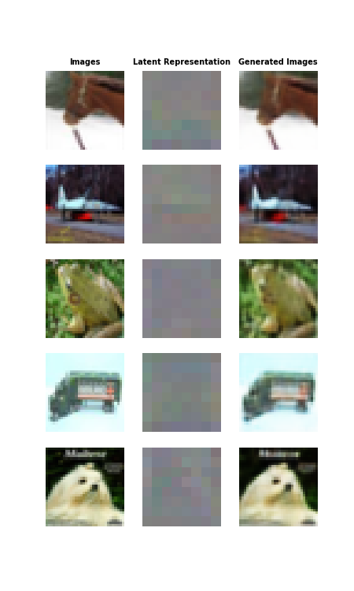
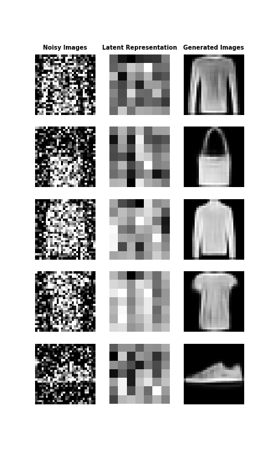
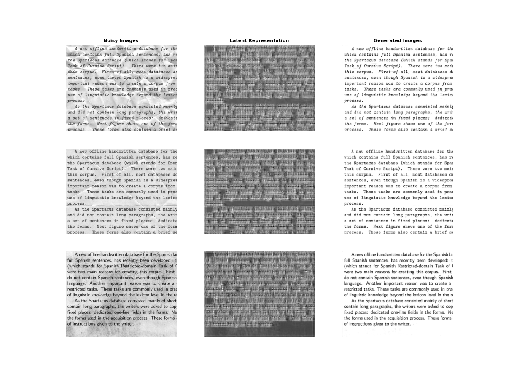

# <h1 align="center">**Autoencoder**</h1>

 

An [Autoencoder](https://www.deeplearningbook.org/contents/autoencoders.html) is a type of neural network designed to reconstruct its inputs. It consists of two main components: an Encoder that reduces the dimensionality of the data and creates a compressed latent representation, and a Decoder that expands this representation to approximate the original input. Autoencoders have various applications, such as denoising images, detecting anomalies in data, and generating new samples similar to the training data. Additionally, they are also used for dimensionality reduction.

## **Implementations in TensorFlow and PyTorch**
Implementations have been done in both TensorFlow and PyTorch, the two most widely used frameworks in Deep Learning, to explore the capabilities of Autoencoders. Each implementation provides insights into the differences and similarities between these frameworks, offering practical perspectives for professionals in the field.

## **Datasets Used**

- **CIFAR-10**: This dataset consists of 60000 color images with 10 classes and 6000 images per class.

- **Fashion-MNIST**: This dataset consists of 70,000 grayscale images representing clothing items, distributed across 10 different categories.

- **MNIST**: This dataset consists of 70,000 grayscale images of handwritten digits ranging from 0 to 9.

- **Text Image**: The training set for this dataset includes 144 grayscale images containing text and an additional 144 images containing text with noise. The test set comprises 72 grayscale images containing noisy text. The dataset is hosted on my [personal Google Drive](https://drive.google.com/file/d/1_kg9xHF_E4-7smIWIrnPQGH0qBhwoGac/view?usp=sharing)

## **Results achieved by the models**

    

        
        
    

 

 

*More examples can be found in the model notebooks.*

## **Technological Stack**
 

## **Contact**

